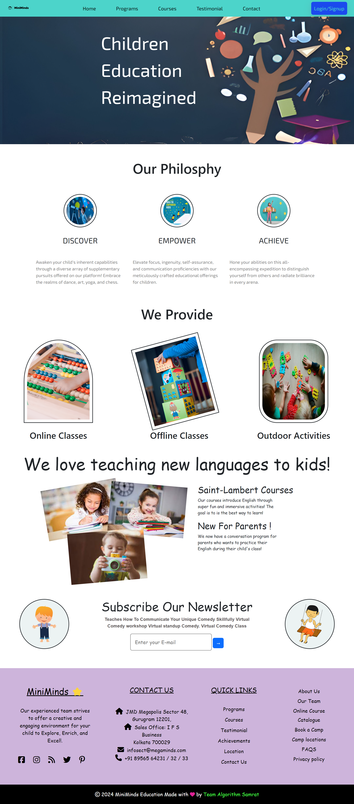
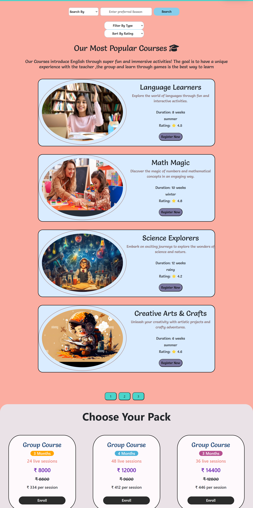
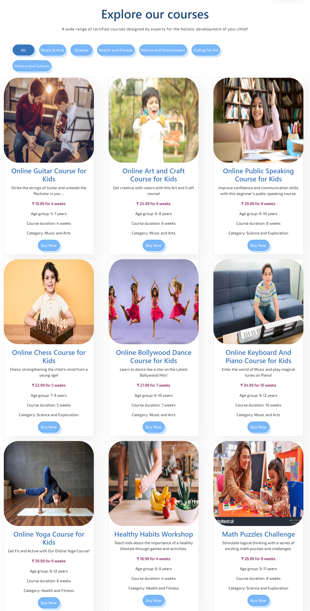

# Miniminds


##  A full stack web app for a child education portal

## Overview

Child Education Hub is a unique project designed to cater to the diverse learning needs of children through a blend of online, offline, and outdoor courses. We understand that every child is unique, and our platform is committed to offering a variety of engaging educational opportunities to suit their individual preferences and learning styles.Miniminds is more than just a website; it's a gateway to a world of possibilities for your child's education. Let's embark on this exciting learning journey together!

# ProjectLink
https://65ae0a3a32bdb7f45c486224--willowy-crepe-4809ab.netlify.app/html/

## Team Members

- Team Lead: [Mayank] 
- Team Members: 
    [Vaibhav] 
    [Pavan Kumar] 
    [Yogesh]
    [Shubham]

## Technologies Used

- HTML
- CSS
- Bootstrap
- javascript

## Group Name

# algorithm-samrat-7890

## Project Duration

4 days

## Features

# Key Features

## 1. Online Courses
Immerse your child in a world of knowledge with our carefully curated online courses. Our interactive and age-appropriate content covers a wide range of subjects, from mathematics and science to arts and languages. The user-friendly interface ensures a seamless learning experience, making education enjoyable and accessible.

## 2. Offline Courses
For those who prefer a more hands-on approach, our offline courses provide interactive learning materials and activities. These courses are designed to promote critical thinking, problem-solving skills, and teamwork. Explore the world of offline learning with Child Education Hub and watch your child thrive.

## 3. Outdoor Learning
We believe that learning goes beyond the confines of traditional classrooms. Child Education Hub offers outdoor courses that blend education with adventure. From nature walks and science expeditions to art in the park, our outdoor courses aim to make learning a dynamic and memorable experience.

# Screenshots

## Login Page


## Signup Page


## Landing Page


## Programs Page


## Courses page



## Contact page

# Getting Started


To view the Reliance Digital Clone locally, follow these steps:

## Clone the repository:

   ```bash
   git clone (https://github.com/vaibhavsingh326/algorithm-samrat-7890.git)
   ```


### Explore Courses: 
Browse through our diverse range of courses and choose the ones that best suit your child's interests.

### Create an Account: 
Sign up to personalize your child's learning journey and track their progress.

### Enroll in Courses: 
Enroll your child in online, offline, or outdoor courses to kickstart their educational adventure.

### Connect with Community:
Join our community of parents, educators, and learners to share experiences, tips, and support each other in fostering a love for learning.
